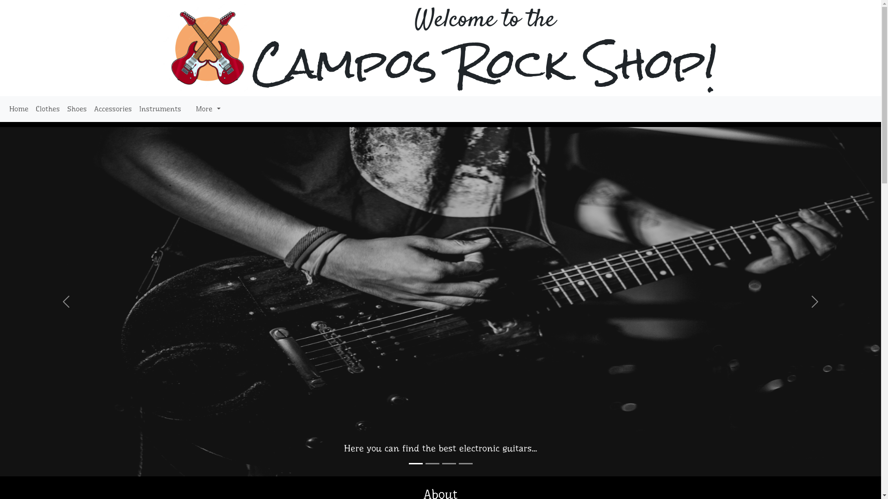
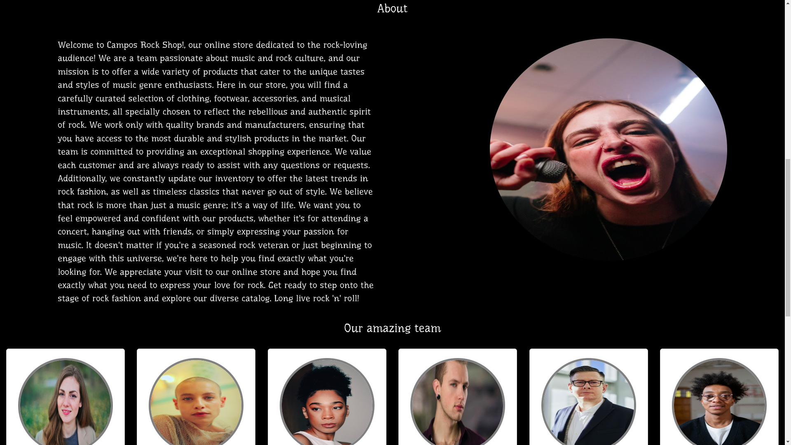
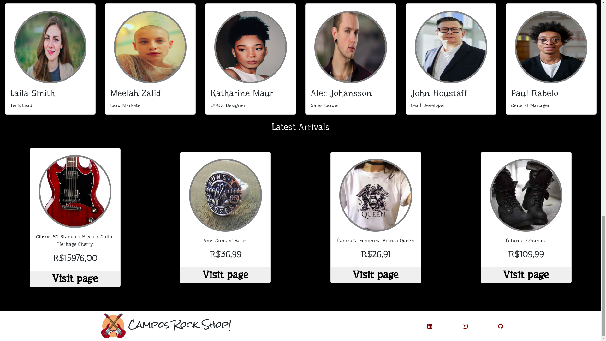
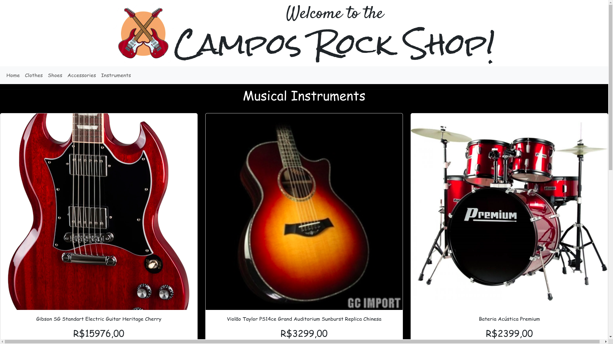

# Projeto Campos Rock Shop!

## Objetivos
Criação de uma loja virtual de produtos voltados ao público roqueiro. Os produtos são divididos em quatro categorias:
 - roupas
 - sapatos
 - instrumentos musicais
 - acessórios

 ## Tecnologias utilizadas
 - HTML
 - CSS
 - Bootstrap

 ## Layout

Homepage:
 
 
 

 Página de instrumentos musicais:
 

 ## Link do site:
 https://campos-rock-shop.surge.sh/

## Como rodar este projeto:
```
#Clone este repositório:
git clone https://github.com/carolcampos22/projeto-html-css-bootstrap-descomplica

#Abra a pasta do projeto
#Procure pelo arquivo index.html (ou quanquer outro .html) e abra-o em seu navegador
```
 
